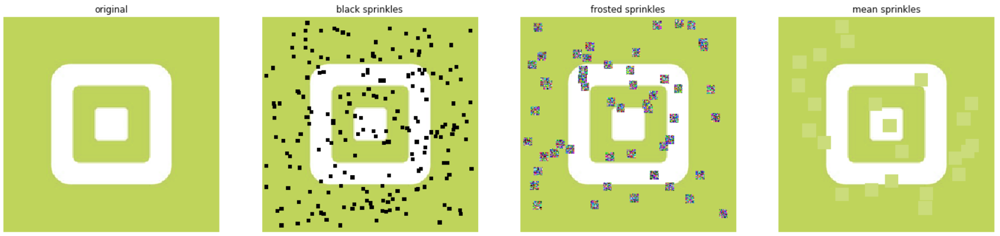

# keras_sprinkles
Image augmentation function for keras

Based on [Less Wright's Medium post](https://medium.com/@lessw/progressive-sprinkles-a-new-data-augmentation-for-cnns-and-helps-achieve-new-98-nih-malaria-6056965f671a),
a function to augment images by adding 'sprinkles' of chosen size and type.

Example use
```
black_sprinkles = sprinkles(img, size=5, perc=0.1)
frosted_sprinkles = sprinkles(img, size=10, perc=0.1, style='frosted')
mean_sprinkles = sprinkles(img, size=15, perc=0.1, style='mean')
```

