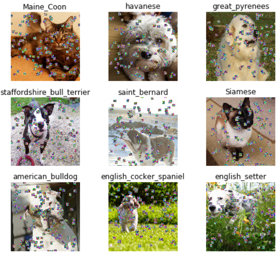

# sprinkles
Image augmentation function

Based on [Less Wright's Medium post](https://medium.com/@lessw/progressive-sprinkles-a-new-data-augmentation-for-cnns-and-helps-achieve-new-98-nih-malaria-6056965f671a),
a function to augment images by adding 'sprinkles' of chosen size and type.

### Stand-alone function

Example use
```
img = cv2.imread("image.png")

black_sprinkles = sprinkles(img, size=5, perc=0.1)
frosted_sprinkles = sprinkles(img, size=10, perc=0.1, style='frosted')
mean_sprinkles = sprinkles(img, size=15, perc=0.1, style='mean')
```


### fast.ai xtra_tfms() compatible function

Example use

```
# code snippet from fast.ai dl1 lesson1-pets.ipynb
data = ImageDataBunch.from_name_re(path_img, fnames, pat,
ds_tfms=get_transforms(xtra_tfms=[sprinkles(size=10, perc=0.2, style='frosted')]), size=224, bs=bs).normalize(imagenet_stats)
```
